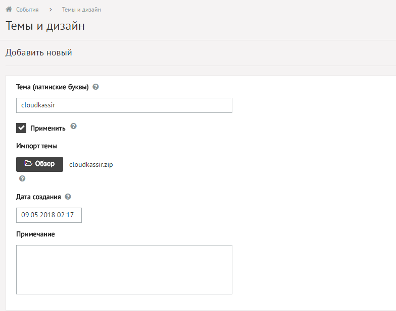
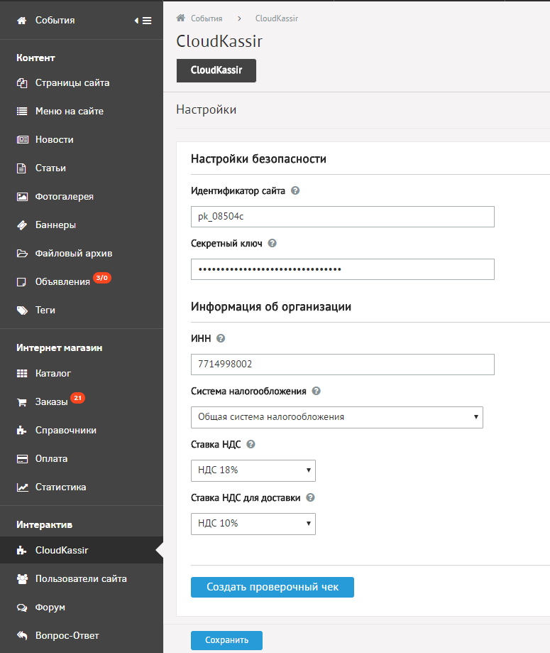
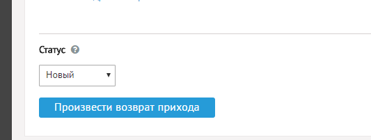

#  CloudKassir модуль для DiafanCMS

Модуль позволяет интегрировать онлайн-кассу [CloudKassir](https://cloudkassir.ru/) в интернет-магазин на платформе DiafanCMS.

### Совместимость:
* DiafanCMS v.6.0.x и выше

### Возможности:    
• Поддержка онлайн-касс (ФЗ-54);  
• Автоматическая отправка чеков прихода по email и SMS;  
• Отправка чеков возврата по email и SMS;  

### Установка модуля

1. В разделе "Темы и дизайн" добавить тему вручную, указать название "cloudkassir" и выбрать прилагаемый архив и сохранить тему 

2. В разделе "Модули и БД" выбрать модуль "CloudKassir" и перезагрузить страницу. Должен появится новый раздел в меню "CloudKassir" (в группе "Интерактив") 

Распаковать из архива каталог upload и загрузить в корень OpenCart.

### Настройка модуля

Перейти в настройки модуля "CloudKassir" из меню и указать следующий параметры
* Идентификатор сайта — Public id сайта из личного кабинета CloudPayments
* Секретный ключ — API Secret из личного кабинета CloudPayments
* ИНН — ИНН организации, на которую зарегистрирована онлайн-касса
* Ставка НДС — Указание ставки НДС.
    Все возможные значения указаны в документации https://cloudpayments.ru/Docs/Kassa#data-format
* Ставка НДС для доставки — Указание отдельной ставки НДС для доставки.
    Если доставка платная, то она в чеке оформляется отдельной строкой со своей ставкой НДС.
    Значения аналогично ставке НДС для товаров.
* Система налогообложения — Тип системы налогообложения.
    Возможные значения перечислены в документации CloudPayments https://cloudpayments.ru/Docs/Directory#taxation-system    

Затем сохранить введенные параметры.

Можно проверить создание чека нажав соответствующую кнопку в настройках модуля, после чего система создает чек на **случайно выбранный заказ** 

Включать/отключать модуль можно в разделе "Темы и дизайн" соответсвенно включая/отключая галочку "Применить" у темы "cloudkassir"

### Формирование чека возврата прихода

Модуль позволяет сформировать чек возврата прихода, для чего добавляется кнопка "Произвести возврат прихода" в редактирование заказа

 